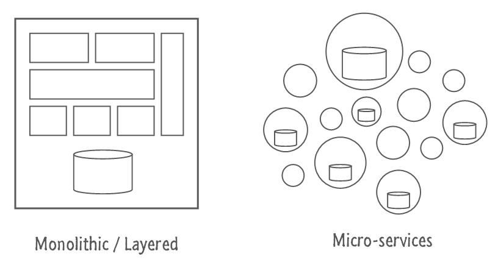

# Allsports Stats Service

---

## Why?

- Usable stat api for SD |
- Able to manage a lot of data |
- Faster datashop generation |

---

## Status

- Deployed on 5 sports |
- No changes for the quant users |
- Need to add pagination to manage stat heavy sport datashop (tennis) |

---

## Microservices



- Service based architecture |
- Services vs Monolith |
- Independently developed / deployed / scalabled |
- Stats: good candidate for a first microservice |
- Another good candidate: Market |

---

### Nameko

- Simple microservice implementation |
- MQ based (Similar to Celery) |

---

## MongoDB

- Document based DB |
- Less rigid than relational database |
- Query system programming friendly (as opposed to SQL) |

---

### MongoDB - Insert

```javascript
db.users.insertOne({
    id: 12345,
    name: "Oliver Smith",
    age: 29,
    job: "clown",
    extra: {"shoe size": 18}
})
```
@[1](Insert in the collection `user`,)
@[2-6](this document)
@[6](which can be nested)

---

### MongoDB - Find All

```javascript
db.users.find({})
```

---

### MongoDB - Find with filter

```javascript
db.users.find({
    job: "clown",
    name: "/^Oliver/"
})
```
@[1](Find all users ...)
@[2](... that have clown as job ... )
@[3](... and a name starting with Oliver)


---

### MongoDB - Find using operators

```javascript
db.users.find({
    age: {
        $gt: 35,
        $lt: 50
    }
})
```
@[2-5](... that are aged between 35 and 50)

---

### MongoDB - Aggregation Pipeline

```javascript
db.users.aggregate([{
    $group: {_id: "$job", average_age: {$avg: "$age"}}
}])
```
@[1](Aggregate users ...)
@[2](by jobs and compute average age for each group)

---

## Bonus

---

## How I created this presentation

- written in Markdown |
- displayed using gitpitch |
- [stored on github](https://github.com/nicolas-leydet/presentations) |

---

## Questions ?
